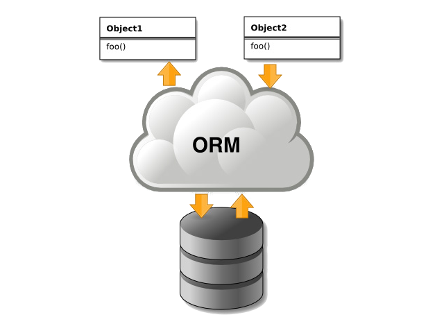
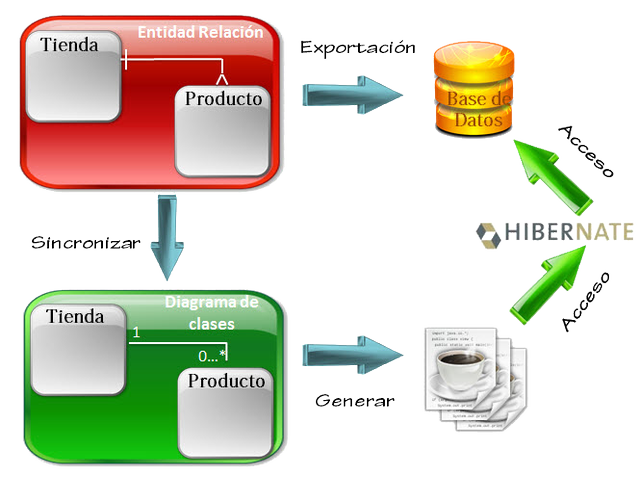
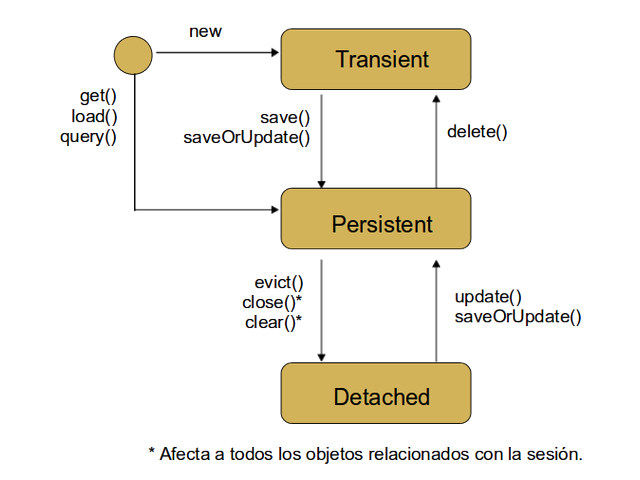
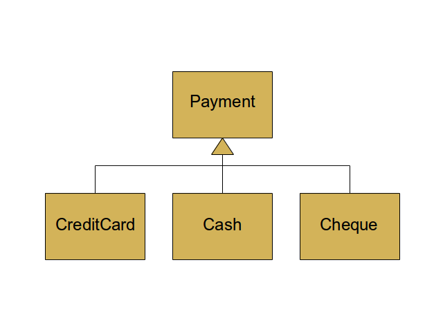

% Persistencia con Hibernate
% Adolfo Sanz De Diego
% Noviembre 2013

# Creditos

## Pronoide

- Pronoide consolida sus servicios de formación superando
  las **22.000 horas impartidas** en más de 500 cursos (Diciembre 2011)

- En la vorágine de **tecnologías y marcos de trabajo existentes**,
  una empresa dedica demasiado esfuerzo en
  analizar, comparar y finalmente decidir cuáles son los
  pilares sobre los que construir sus proyectos.

- Nuestros Servicios de Formación permiten ayudarle en esta tarea,
  transfiriéndoles nuestra **experiencia real de más de 10 años**.

## Autor

- **Adolfo Sanz De Diego**

- Mi nick: **asanzdiego**

- AboutMe: **[http://about.me/asanzdiego](http://about.me/asanzdiego)**

    - GitHub:   [http://github.com/asanzdiego/](http://github.com/asanzdiego/)
    - Twitter:  [http://twitter.com/asanzdiego](http://twitter.com/asanzdiego)
    - Blog:     [http://asanzdiego.blogspot.com.es](http://asanzdiego.blogspot.com.es)
    - LinkedIn: [http://www.linkedin.com/in/asanzdiego](http://www.linkedin.com/in/asanzdiego)

## Licencia

- Estas **transparencias** están bajo una licencia:
    - Creative Commons Reconocimiento-CompartirIgual 3.0 [http://creativecommons.org/licenses/by-sa/3.0/es/](http://creativecommons.org/licenses/by-sa/3.0/es/)

- El **código fuente** de los programas están bajo una licencia:
    - GPL 3.0 [http://www.viti.es/gnu/licenses/gpl.html](http://www.viti.es/gnu/licenses/gpl.html)

# Introducción

## Bases de datos relacionales

- En una aplicación manejamos la información con **objetos**,
  y normalmente guardamos estos datos en un **BD relacional**.

- Esto tiene varios **inconvenientes**:
    - Hay que generar mucho código JDBC.
    - Cada BD tiene su propio dialecto.
    - No hay una conversión directa de objetos a tablas.

## Object Relational Mapping

- ORM intenta **solucionar los problemas** anteriores:
    - Lee/escribe objetos directamente desde/hacia la BD.
    - Ahorra mucho código siendo las aplicaciones más mantenibles.
    - Se abstrae de las particularidades de la BD.

## Hibernate

- Es el ORM más **exitoso** y además es Software Libre (**LGPL**).
- **No requiere contenedor y no es intrusivo**.
- Es compatible con **JPA** (aunque pierde funcionalidad).

# Conexión a una BD

## Hibernate.cfg.xml

- Fichero de **configuración** donde indicamos cosas como:
    - Cual es la BD y su localización.
    - Dialecto de SQL.
    - Cómo obtener conexiones.
    - Generación automática del esquema de BD.
    - Localización de los ficheros de mapeo.

~~~{.xml}
<?xml version='1.0' encoding='UTF-8'?>
<!DOCTYPE hibernate-configuration PUBLIC "-//Hibernate/Hibernate Configuration DTD 3.0//EN"
  "http://hibernate.sourceforge.net/hibernate-configuration-3.0.dtd">
<hibernate-configuration>
  <session-factory>
    <property name="connection.url">jdbc:mysql://localhost:3306/bbdd</property>
    <property name="connection.driver_class">com.mysql.jdbc.Driver</property>
    <property name="connection.username">root</property>
    <property name="connection.password">root</property>
    <property name="dialect">org.hibernate.dialect.MySQLDialect</property>
    <property name="hibernate.show_sql">true</property>
    <property name="hibernate.hbm2ddl.auto">update</property>
    <property name="transaction.factory_class">
      org.hibernate.transaction.JDBCTransactionFactory
    </property>
    <property name="current_session_context_class">thread</property>
    <mapping resource="/cfg/hbm.xml"/>
  </session-factory>
</hibernate-configuration>
~~~

## SessionFactory

- Primer objeto que creamos.
- Creada a partir de hibernate.cfg.xml.
- Muy costosa de crear y se puede compartir por varios hilos (threadsafe).
- Un único **SessionFactory por cada BD** a la que nos conectemos en cada aplicación.
- Su cometido es ocultar la complejidad de crear sesiones de persistencia.

~~~{.java}
SessionFactory sessionFactory =
  new Configuration()
    .configure("/cfg/hibernate.cfg.xml")
      .buildSessionFactory();
~~~

## Session

- Se obtiene de la SessionFactory.
- Es la **principal interfaz** entre nuestra aplicación e Hibernate.
- Responsable de guardar y leer objetos de la BBDD.
- Asociada a una conexión.
- No se debe compartir entre hilos.
- Es preciso desconectar y cerrar las sesiones cuando ya no son necesarias.
- Podemos crearlas y cerrarlas según nuestras necesidades.

~~~{.java}
Session s = sessionFactory.openSession();
~~~

# Persistencia de objetos

## Insertar un objeto

- El ID no puede contener un valor, a no ser que use
  \<generator class="assigned" />, en cuyo caso será obligatorio.

~~~{.java}
Persona p = new Persona(0, "Homer Jay Simpson", "C/Evergeen Terrace");
Session s = sessionFactory.openSession();
s.beginTransaction();
Integer id = (Integer) s.save(p);
s.getTransaction().commit();
s.disconnect();
s.close();
~~~

## Actualizar o borrar un objeto

- **session.update(objeto)**: Actualiza un objeto en base de datos.

~~~{.java}
session.update(objeto);
~~~

- **session.saveOrUpdate(objeto)**: Salva o actualiza un objeto en base de datos.

~~~{.java}
session.saveOrUpdate(objeto);
~~~

- **session.delete(objeto)**: Borra un objeto en base de datos.

~~~{.java}
session.delete(objeto);
~~~

## Leer un objeto

- **session.get()**: Devuelve null si no encuentra el objeto.

~~~{.java}
Persona p = (Persona) s.get(Persona.class, id);
~~~

- **session.load()**: Lanza una excepción si no encuentra el objeto.

~~~{.java}
Persona p = (Persona) s.load(Persona.class, id);
~~~

## Deshacer cambios

- **sesion.refresh(objeto)**: Vuelve a cargar los datos de la BD.
  Es necesario que el objeto tenga valor en el ID.

~~~{.java}
sesion.refresh(objeto)
~~~

## Transacciones

- Cuando usemos una sesión para modificar la BD se usará siempre una transacción.
- La sesión es nuestra factoría de transacciones.
- La transacción que proporciona puede ser JDBC ó JTA.
- Una sesión **sólo persistirá con clases que estén mapeadas**.

# Ciclo de vida

## Esquema

## Transient, Persistent y Detached

- **Transient**
    - El objeto se ha creado pero al no estar persistido no tiene ID.

- **Persistent**
    - Tiene representación en la base de datos y por lo tanto un valor en el ID.
    - El objeto está sincronizado con su equivalente en la BD.

- **Detached**
    - Tiene representación en la base de datos y por lo tanto un valor en el ID.
    - El objeto no está sincronizado con su equivalente en la BD.

## Sincronización

- Mientras el objeto está en estado **Persistent**, no es necesario el update,
  pues la sesión actualiza la BD con los valores de todos los objetos
 transaccionales que esté manejando en el momento de hacer commit.

~~~{.java}
Session s = sf.openSession();
s.beginTransaction();
Persona p = (Persona) s.get(Persona.class, 4);
p.setNombre("Homer J Simpson");
s.getTransaction().commit();
s.disconnect();
s.close();
~~~

## Evict, clear, merge y flush

- **session.evict(object)**:
    - Se utiliza para que la sesión pase un objeto a detached.
    - Podemos seguir usando el objeto, pero sus cambios no se peristirán.

- **session.clear()**:
    - La sesión se deshace de todos sus objetos persistentes,
      que pasan a detached.

- **session.merge(obj)**:
    - Fusiona un objeto detached con otro persistente con el mismo ID.
    - Si no hay un objeto persistente, intenta cargarlo o crearlo nuevo.
    - Devuelve un objeto persistente copia del original,
      el objeto original sigue en estado detached.

- **session.flush()**:
    - Los objetos no se persisten realmente hasta que se se cierra la session.
    - Con flush forzamos la persistencia antes de cerrarla.

# Mapeo XML

## Mapeo de objetos

- **POJOS**:
    - Constructor sin parámetros (obligatorio).
    - Métodos get y set (opcional).
    - Preferentemente clases no final (opcional).
    - Podemos utilizarlos fuera del ámbito de Hibernate.

~~~{.java}
public class Persona {

  private int idPersona;
  private String nombre;
  private String direccion;
  private boolean estado;
  private java.util.Date fechaNacimiento;

  public Persona() {
    super();
  }

  // getters y setters
  ...
}
~~~

## hbm.xml

- Indicamos en el fichero de mapeo, para cada POJO:

    - A qué **tabla** va, el **ID** y los **atributos**
      que queremos persistir y a qué columnas.

    - Los nombres de tabla y de columna y los tipos de datos
      se pueden omitir, e Hibernate los obtendrá mediante reflection
      (más costoso).

~~~{.xml}
<?xml version="1.0" encoding="UTF-8"?>
<!DOCTYPE hibernate-mapping PUBLIC
  "-//Hibernate/Hibernate Mapping DTD 3.0//EN"
  "http://hibernate.sourceforge.net/hibernate-mapping-3.0.dtd" >

<hibernate-mapping>
  <class name="modelo.Persona" table="persona">
    <id name="idPersona" column="id_persona">
      <generator class="increment" />
    </id>
    <property name="nombre" not-null="true"/>
    <property name="direccion"/>
    <property name="estado"/>
    <property name="fechaNacimiento" type="date"/>
  </class>
</hibernate-mapping>
~~~

## El ID

- Es imprescindible indicar un ID.
- Generación del ID:
    - **Increment**: Clave entera autoincremental DB2, MySQL, MS SQL Server and Sybase.
    - **Sequence**: Clave entera obtenida de una secuencia. DB2, PostgreSQL, Oracle.
    - **Native**: Selecciona increment o sequence dependiendo de las capacidades de la BD.
    - **Assigned**: Permite a la aplicación generar la clave. Debe asignarse al objeto antes de persistirlo.
    - **Foreign**: Utiliza una clave obtenida de otro objeto persistido anteriormente.

## ID compuesto con un POJO

- Crear un POJO con un atributo para cada columna de la clave.

- El ID pasa a ser un objeto de esa clase.

~~~{.xml}
<composite-id name="claveCompuesta" class="mipaquete.Clave">
  <key-property name="atributo1"/>
  <key-property name="atributo2"/>
  [...]
</composite-id>
~~~

## ID compuesto sin un POJO

~~~{.xml}
<composite-id>
  <key-property name="atributo1" type="java.lang.String">
    <column name="COLUMNA_1" length="2" not-null="true" />
  </key-property>
  <key-property name="atributo2" type="java.lang.String">
    <column name="COLUMNA_2" length="2" not-null="true" />
  </key-property>
</composite-id>
~~~

## Mapeo de atributos

~~~{.xml}
<property
  name="nombre del atributo" column="nombre_de_la-columna" type="tipo"
  not-null="true|false" unique="true|false"
  update="true|false" insert="true|false"
  formula="sql"/>
~~~

- Si se omite el nombre de la columna y el tipo,
  Hibernate usa reflection para obtener esa información (más costoso).

- Si no queremos persistir un atributo de la clase,
  basta con no añadirlo al fichero hbm.xml

- **update/insert**:
    - **True**: si se incluye la columna en ese tipo de consultas.
    - **False**: implica que solo se lee el dato de la BD
      y se genera/actualiza fuera de la aplicación.

- **formula**:
    - permite obtener un atributo como fórmula de campos.

~~~{.xml}
<property name="totalIva" column="TOTAL_IVA" formula="TOTAL * IVA"/>
~~~

## Mapeo de varias clases a una tabla

~~~{.java}
public class Cliente {
  private int idCliente;
  private String nombre;
  private Direccion direccion;
  ...
}
~~~

~~~{.xml}
<class name="Cliente" table="CLIENTE">
  ...
  <component name="direccion" class="modelo.Direccion">
    <property name="calle"/>
    <property name="ciudad"/>
    <property name="codigoPostal" column="CODIGO_POSTAL"/>
  </component>
  ...
</class>
~~~

# Mapeo de Relaciones

## One to many con Set (I)

- Un set **no admite duplicados y no mantiene el orden** de inserción.
- Utilizamos en el 'Cliente' un set de pedidos.
- En el 'Pedido' se declara un atributo del tipo 'Cliente'.

~~~{.java}
public class Cliente {

  private Integer idCliente;
  private String nombre;

  //  Relación one-to-many
  private Set<Pedido> pedidos;
}
~~~

~~~{.java}
public class Pedido {

  private Integer idPedido;
  private String codigo;

  // Relación many-to-one
  private Cliente cliente;
}
~~~

## One to many con Set (II)

- Indicamos, tanto en 'Cliente' como en 'Pedido'
  la columna que hará de **clave foránea**.

~~~{.xml}
<class name="modelo.Cliente" table="cliente">
  <id name="idCliente" column="ID_CLIENTE">
    <generator class="identity" />
  </id>
  <property name="nombre" />
  <set name="pedidos" cascade="all">
    <key column="ID_CLIENTE" />
    <one-to-many class="modelo.Pedido" />
  </set>
</class>
~~~

~~~{.xml}
<class name="modelo.Pedido" table="pedidos">
  <id name="idPedido" column="ID_PEDIDO">
    <generator class="identity" />
  </id>
  <property name="codigo" />
  <many-to-one name="cliente" column="ID_CLIENTE" />
</class>
~~~

## One to many con List (I)

- Una lista **mantiene el orden en el que se insertan** los elementos.
- Utilizamos en el 'Cliente' un lista de facturas.
- En la 'Factura' se declara un atributo de tipo 'Cliente'.

~~~{.java}
public class Cliente {

  private Integer idCliente;
  private String nombre;

  // Relación one-to-many
  private List<Factura> facturas;
}
~~~

~~~{.java}
public class Factura {

  private Integer idFactura;
  private String codigo;

  // Relación many-to-one
  private Cliente cliente;
}
~~~

## One to many con List (II)

- Es igual que en con el set, sólo que ahora debemos **indicar la columna de orden**
  de la tabla de facturas para saber el orden que estas tienen en el List.
- Al recuperar las facturas del 'Cliente' Hibernate las ordenará utilizando esa columna.

~~~{.xml}
<class name="modelo.Cliente" table="cliente">
  <id name="idCliente" column="ID_CLIENTE">
    <generator class="identity" />
  </id>
  <property name="nombre" />
  <list name="facturas" cascade="all">
    <key column="ID_CLIENTE" />
    <index column="orden" />
    <one-to-many class="modelo.Factura" />
  </list>
</class>
~~~

~~~{.xml}
<class name="modelo.Factura" table="facturas">
  <id name="idFactura" column="ID_FACTURA" >
    <generator class="identity" />
  </id>
  <property name="codigo" />
  <many-to-one name="cliente" column="ID_CLIENTE" />
</class>
~~~

## Many to many (I)

- Existe en orientación a objetos pero no en BD, dónde se establece con
  una **tabla intermedia** con los ID de los dos extremos.
- Un set de comerciales en el cliente.
- Un set de clientes en el comercial.

~~~{.java}
public class Cliente {

  private Integer idCliente;
  private String nombre;

  // Relación many-to-many
  private Set<Comercial> comerciales;
}
~~~

~~~{.java}
public class Comercial {

  private Integer idComercial;
  private String nombre;

  // Relación many-to-many
  private Set<Cliente> clientes;
}
~~~

## Many to many (II)

- Debemos indicar el **nombre de la tabla intermedia**.
- Debemos indicar las **columnas de la clave foránea**.

~~~{.xml}
<class name="modelo.Cliente" table="cliente">
  <id name="idCliente" column="ID_CLIENTE">
    <generator class="identity" />
  </id>
  <set name="comerciales" table="cliente-comercial">
    <key column="ID_CLIENTE" />
    <many-to-many class="modelo.Comercial" column="ID_COMERCIAL"/>
  </set>
</class>
~~~

~~~{.xml}
<class name="modelo.Comercial" table="comerciales">
  <id name="idComercial" column="ID_COMERCIAL">
    <generator class="identity" />
  </id>
  <set name="clientes" table="cliente-comercial">
    <key column="ID_COMERCIAL" />
    <many-to-many class="modelo.Cliente" column="ID_CLIENTE"/>
  </set>
</class>
~~~

## Many to many (III)

- **Problemas**:
    - Hibernate gestiona la tabla intermedia
      y no nos permite añadir más columnas que los identificadores.

- **Solución recomendada**:
    - Crear una entidad intermedia que mantenga relaciones
      de muchos a uno con las otras dos.

## One to one (I)

- Un atributo del tipo 'DatosBancarios' en el cliente.
- Un atributo del tipo 'Cliente' en los datos bancarios.

~~~{.java}
public class Cliente {

  private Integer idCliente;
  private String nombre;

  // Relacion one-to-one
  private DatosBancarios datos;
}
~~~

~~~{.java}
public class DatosBancarios {

  private Integer idCliente;

  //Relacion one-to-one
  private Cliente cliente;
}
~~~

## One to one (II)

- Indicamos que el atributo 'datosBancarios' surge de una relacion de uno a uno con la clase 'DatosBancarios'.

~~~{.xml}
<class name="modelo.Cliente" table="cliente">
  <id name="idCliente" column="ID_CLIENTE">
    <generator class="identity" />
  </id>
  <one-to-one name="datos" class="modelo.DatosBancarios"/>
</class>
~~~

- Para **asignar el mismo ID** al objeto 'datosBancarios' que al cliente usamos en el ID 'foreign'.
- Foreign implica que el ID viene de otra tabla.
- Indicamos que el ID es el de 'Cliente' en un parámetro.

~~~{.xml}
<class name="modelo.DatosBancarios">
  <id name="idCliente" column="id_cliente">
    <generator class="foreign">
      <param name="property">cliente</param>
    </generator>
  </id>
  <one-to-one name="cliente" class="modelo.Cliente"/>
</class>
~~~

## Carga ansiosa EAGER

- Leer el objeto supone **obtener también los objetos con los que está relacionado**.
- Puede utilizarse en cualquier tipo de relación.
- Seleccionado por defecto en relaciones one-to-one.
- Usado incorrectamente, puede malgastar los recursos.

~~~{.xml}
<set name="pedidos" lazy="false">
  <key column="id_cliente" />
  <one-to-many class="modelo.Pedido" />
</set>
~~~

## Carga perezosa LAZY

- Se lee el objeto pero **no se cargan sus relaciones hasta que se acceda a ellas**.
- Puede utilizarse en cualquier tipo de relación.
- Seleccionado por defecto en relaciones one-to-many y many-to-many.
- Cuando hay carga perezosa, Hibernate nos entrega proxies.

~~~{.xml}
<set name="pedidos" lazy="true">
  <key column="id_cliente" />
  <one-to-many class="modelo.Pedido" />
</set>
~~~

## Proxies

- El proxy que devuelve Hibernate cuando hay carga perezosa es un interceptor
  que avisa a la sesión del acceso a la información no cargada.

- La sesión recibe el aviso y ejecuta el select pertinente.

- Si se ha cerrado la sesión con la que se cargó el objeto
  y se intenta acceder a las relaciones no cargadas se lanza una **LazyInicializationException**.

## Cascade

~~~{.xml}
<class name="Cliente">
  <set name="pedidos" cascade="all">
    <key column="id_cliente" />
    <one-to-many class="modelo.Pedido" />
  </set>
</class>
~~~

- **cascade="none"**: por defecto Hibernate ignora la asociacion.

- **cascade="save-update"**: Hibernate recorrerá la relacion cuando se persista
  el primer objeto e insertará o modificará los objetos nuevos y los que esten modificados.

- **cascade="delete"**: Hibernate recorrerá la relación borrando los objetos
  que se hayan eliminado de la relación.

- **cascade="all"**: Hibernate propagará las inserciones, modificaciones
  y borrados a lo largo de la relación.

- **cascade="all-delete-orphan"**: igual que 'all' pero además se eliminarán
  aquellas entidades que queden sin referencia en la BD.

- **cascade="delete-orphan"**: Hibernate eliminará las entidades que queden
  sin referencia en la BD.

# Mapeo de Herencia

## Ejemplo

## Estatregias

- Hibernate permite persistir objetos de clases que utilizan herencia.
- Existen 3 estrategias para organizar la información en la BD.
    - **Una sola tabla para todas las clases**
    - **Una tabla para cada clase (la padre y las hijas)**
    - **Una tabla para cada subclase (sólo las hijas)**
- La estrategia escogida es transparente para la aplicación

## Una sóla tabla para todas las clases

- Se mapean todas las clases (la padre y las hijas) en una sola tabla.
- Las columnas que mapeen los atributos distintos de las clases hijas
  deberán ser **nullables**.
- Se añade una columna a la tabla para indicar
  el subtipo de cada registro (**discriminator column**).

~~~{.xml}
<class name="Payment" table="PAYMENT">
    <id name="id" type="long" column="PAYMENT_ID">
        <generator class="native"/>
    </id>
    <discriminator column="PAYMENT_TYPE" type="string"/>
    <property name="amount" column="AMOUNT"/>
    ...
    <subclass name="CreditCardPayment" discriminator-value="CREDIT">
        <property name="creditCardType" column="CCTYPE"/>
        ...
    </subclass>
    <subclass name="CashPayment" discriminator-value="CASH">
        ...
    </subclass>
    <subclass name="ChequePayment" discriminator-value="CHEQUE">
        ...
    </subclass>
</class>
~~~

## Una tabla para cada clase (la padre y las hijas)

- Se mapean todas las clases (la padre y las hijas) en tablas distintas.
- No hay columnas infrautilizadas y todas **pueden ser not-null**.
- Las consultas se realizan con join, más lento que con una sola tabla.
- **Generalmente la mejor solución**.

~~~{.xml}
<class name="Payment" table="PAYMENT">
    <id name="id" type="long" column="PAYMENT_ID">
        <generator class="native"/>
    </id>
    <property name="amount" column="AMOUNT"/>
    ...
    <joined-subclass name="CreditCardPayment" table="CREDIT_PAYMENT">
        <key column="PAYMENT_ID"/>
        <property name="creditCardType" column="CCTYPE"/>
        ...
    </joined-subclass>
    <joined-subclass name="CashPayment" table="CASH_PAYMENT">
        <key column="PAYMENT_ID"/>
        ...
    </joined-subclass>
    <joined-subclass name="ChequePayment" table="CHEQUE_PAYMENT">
        <key column="PAYMENT_ID"/>
        ...
    </joined-subclass>
</class>
~~~

## Una tabla para cada subclase (sólo las hijas)

- Se mapean sólo las clases hijas en tablas distintas.
- Las **columnas heredadas se repiten** en cada tabla,
  y además deberán ser **nullables**.
- Tiene los problemas de las 2 opciones anteriores.

~~~{.xml}
<class name="Payment">
    <id name="id" type="long" column="PAYMENT_ID">
        <generator class="sequence"/>
    </id>
    <property name="amount" column="AMOUNT"/>
    ...
    <union-subclass name="CreditCardPayment" table="CREDIT_PAYMENT">
        <property name="creditCardType" column="CCTYPE"/>
        ...
    </union-subclass>
    <union-subclass name="CashPayment" table="CASH_PAYMENT">
        ...
    </union-subclass>
    <union-subclass name="ChequePayment" table="CHEQUE_PAYMENT">
        ...
    </union-subclass>
</class>
~~~

# HQL

## Hibernate Query Language

- Similar a SQL.
- Pero consulta objetos y devuelve objetos.

~~~{.sql}
SELECT c FROM Cliente c WHERE c.pedidos[0]<>NULL
~~~

~~~{.sql}
SELECT new Venta(c, p) FROM Cliente c, Pedido p
~~~

## Objeto Query

~~~{.java}
Query q = session.createQuery("...");
q.list();
~~~

- Admite paginación:

~~~{.java}
q.setMaxResults(5);
q.setFirstResult(0);
~~~

- Admite prepared statements:

~~~{.java}
q.setParameter(0, "Madrid");
~~~

- Admite filtros de herencia:

~~~{.sql}
WHERE c.class = 'Subclase'
~~~

## Objeto Criteria

- Genera filtros WHERE programáticamente:

~~~{.java}
Criteria c = session.createCriteria(Cliente.class);
c.list();
~~~

- Podemos añadir restricciones:

~~~{.java}
c.add(Restrictions.between("edad", 25, 35) );
c.add(Restrictions.ilike("nombre", "%F%") );
~~~

- Podemos añadir un objeto de ejemplo:

~~~{.java}
Cliente cli = new Cliente("Oliver");
c.add( Example.create(cli) );
~~~
