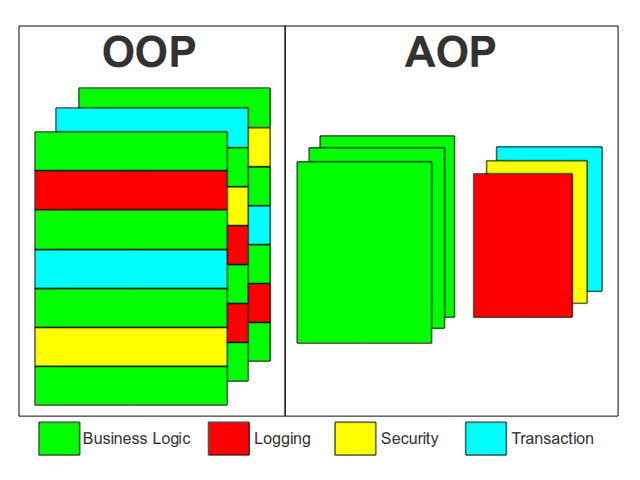
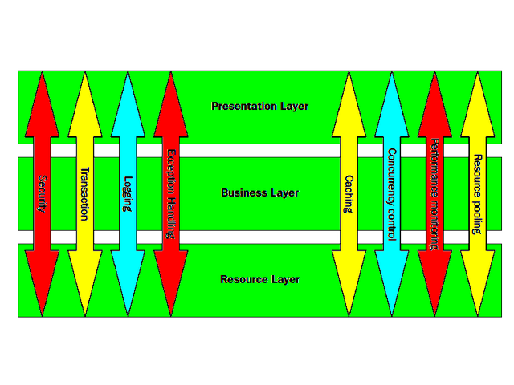
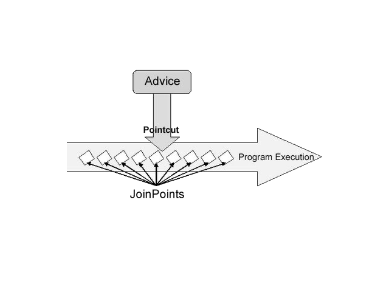
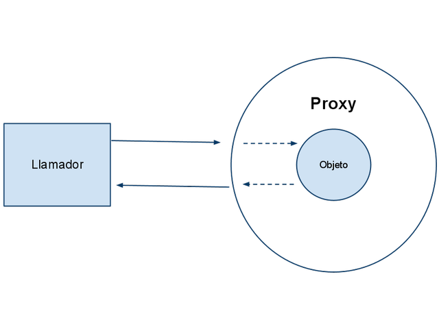
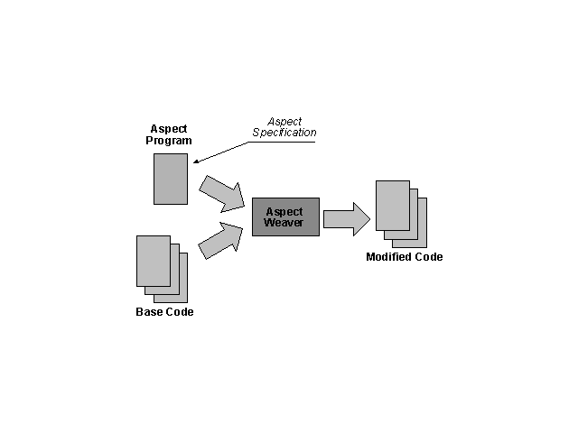

% Spring AOP
% Adolfo Sanz De Diego
% Noviembre 2013

# Creditos

## Pronoide

- Pronoide consolida sus servicios de formación superando
  las **22.000 horas impartidas** en más de 500 cursos (Diciembre 2011)

- En la vorágine de **tecnologías y marcos de trabajo existentes**,
  una empresa dedica demasiado esfuerzo en
  analizar, comparar y finalmente decidir cuáles son los
  pilares sobre los que construir sus proyectos.

- Nuestros Servicios de Formación permiten ayudarle en esta tarea,
  transfiriéndoles nuestra **experiencia real de más de 10 años**.

## Autor

- **Adolfo Sanz De Diego**

- Mi nick: **asanzdiego**

- AboutMe: **[http://about.me/asanzdiego](http://about.me/asanzdiego)**

    - GitHub:   [http://github.com/asanzdiego/](http://github.com/asanzdiego/)
    - Twitter:  [http://twitter.com/asanzdiego](http://twitter.com/asanzdiego)
    - Blog:     [http://asanzdiego.blogspot.com.es](http://asanzdiego.blogspot.com.es)
    - LinkedIn: [http://www.linkedin.com/in/asanzdiego](http://www.linkedin.com/in/asanzdiego)

## Licencia

- Estas **transparencias** están bajo una licencia:
    - Creative Commons Reconocimiento-CompartirIgual 3.0 [http://creativecommons.org/licenses/by-sa/3.0/es/](http://creativecommons.org/licenses/by-sa/3.0/es/)

- El **código fuente** de los programas están bajo una licencia:
    - GPL 3.0 [http://www.viti.es/gnu/licenses/gpl.html](http://www.viti.es/gnu/licenses/gpl.html)

# Introducción

## Aspect Oriented Programming

- Al igual que existe una programación orientada a objetos,
  cuya pieza más significativa son las clases, se ha extendido
  el concepto de **programación orientada a aspectos**,
  considerando un aspecto una funcionalidad o tarea genérica
  que puede afectar a muchas clases.

## Cross-cutting concern

- Los cross-cutting concern, o servicios horizontales,
  son **funcionalidades que afectan a todas las clases de la aplicación**,
  como el logging, la transaccionalidad o la seguridad.

# Conceptos Generales

## Aspect, Join Point, Advice y Pointcut

- **Aspect**:
    - Es la funcionalidad del servicio horizontal
      que se quiere implementar.

- **Join Point**:
    - Es el punto de anclaje en donde, en tiempo de ejecución,
      se aplica el aspecto.

- **Advice**:
    - Es la acción ejecutada por un aspecto en un determinado Join Point.

- **Pointcut**:
    - Es una expresión que selecciona Join Points.

## Introduction, Target Object, Proxy

- **Introduction**:
    - Permite declarar métodos o campos nuevos en un tipo.

- **Target Object**:
    - Objeto observado por uno o más aspectos.

- **Proxy**:
    - Objeto que encapsula internamente un target object.

## Weaving

- **Weaving**:
    - Es la acción de enlazar los aspectos, que puede hacerse en tiempo
      de compilación, de carga, o de ejecución.

## Spring AOP

- En Spring AOP **sólo se permiten join points de ejecución de métodos públicos**,
  para interceptar métodos protegidos o privados utilizar AspectJ.

- En Spring AOP **no se pueden interceptar la lectura y/o la actualización de atributos**,
  para ello utilizar AspectJ.

- Spring AOP es menos potente que AspectJ, pues está enfocado en resolver
  los problemas más habituales de una forma **integrada con el contenedor de IoC**.

- Se pueden definir aspectos con la anotación @AspectJ que necesita Java 5,
  o puede usarse el fichero de configuración.

## Fichero de configuración

- Para poder usarla, deberemos introducir:
    - **http://www.springframework.org/schema/aop**
    - **http://www.springframework.org/schema/aop/spring-aop-2.0.xsd**

- Se utiliza la etiqueta **\<aop:aspect/>** a la que se le índica un **id**
  y el **bean** a la que hace referencia (la que será el aspecto en Java).

~~~{.xml}
<aop:config>
  <aop:aspect id="myAspect" ref="aBean">
  ...
  </aop:aspect>
</aop:config>
<bean id="aBean" class="...">
...
</bean>
~~~

- Todos los aspectos son **Singleton**.

## Habilitar la anotación @Aspect

- Dentro del archivo de configuración incluir:

~~~{.xml}
<aop:aspectj-autoproxy/>
~~~

~~~{.java}
@Aspect
public class Espectador {

  public Espectador(){}

  //Nuevo método para definir el pointcut
  @Pointcut("execution(* *.interpretar(..))")
  public void realizar(){}

  //La anotación se apoya en un método creado donde se encuentra el pointcut
  @Around("realizar()")
  public Object miAdviceAspectJ(ProceedingJoinPoint joinpoint) throws Throwable{
    Object retVal = null;
    try {
      retVal= joinpoint.proceed();
      this.aplaudir();
    } catch (Throwable e) {
      this.solicitarDevolucion();
      throw e;
    }
    return retVal;
  }
}
~~~

# Pointcuts

## Definición

- Un Pointcut puede definirse dentro de un aspecto, sólo visible para él,
  o puede definirse directamente bajo \<aop:config> para estar disponible de forma global.

- Ejemplo: llamadas de todos los métodos públicos de las clases del paquete com.ats.test.

~~~{.xml}
<aop:pointcut id="businessService" expression="execution(public com.ats.test.*.*(..))" />
~~~

## Lenguaje de definición de Pointcuts

- El lenguaje de definición de PointCuts es el de AspectJ, y está estructurado así:

~~~
[execution|within|this|target|args](
  modifiers-pattern?
  return-type-pattern
  declaring-type-pattern?
  name-pattern(param-pattern)
  throws-pattern?
)
~~~

- **'\*'** es un comodín para los tipos de acceso, nombres de clase y métodos

- **'..'** en los argumentos de la llamada, se entiende que es con cualquier tipo de argumentos.

- Se pueden combinar con **'&&'**, **'||'** y **'!'**,
  aunque en el XML debe usarse **'and'**, **'or'** y **'not'**.

## Tipos de pointcut soportados por Spring

- **execution**: para seleccionar la ejecución de un método. Es el más usado.

- **within**: para seleccionar la ejecución de algún metódo del tipo especificado.

- **this**: para seleccionar la ejecución de algún método
  de un bean que implemente una interfaz del tipo especificado.

- **target**: para seleccionar la ejecución de algún método
  de un bean cuyo target object implemente una interfaz del tipo especificado.

- **args**: para seleccionar la ejecución de algún método
  cuyos argumentos sean instancias de los tipos especificado.

**NOTA**: En Spring la diferencia entre this y target, es que el primero
intercepta el proxy y el segundo el objeto encapsulado dentro del proxy.

# Tipos de Advice

## Before Advice

- Se ejecuta justo antes del JoinPoint.

~~~{.xml}
<aop:aspect id="beforeExample" ref="aBean">
  <aop:before pointcut-ref="dataAccessOperation" method="doAccessCheck"/>
</aop:aspect>
~~~

~~~{.java}
import org.aspectj.lang.annotation.Aspect;
import org.aspectj.lang.annotation.Before;

@Aspect
public class BeforeExample {

  @Before("execution(* com.xyz.myapp.dao.*.*(..))")
  public void doAccessCheck() {
    // ...
  }
}
~~~

## After returning Advice

- Igual que el before, salvo que podemos indicar que al aspecto se le devuelva
  el tipo que retorna el método interceptado.

~~~{.xml}
<aop:aspect id="afterReturningExample" ref="aBean">
  <aop:after-returning pointcut="execution(* com.xyz.myapp.dao.*.*(..))" method="doAccessCheck"/>
</aop:aspect>
~~~

~~~{.java}
import org.aspectj.lang.annotation.Aspect;
import org.aspectj.lang.annotation.AfterReturning;

@Aspect
public class AfterReturningExample {

  @AfterReturning(pointcut="execution(* com.xyz.myapp.dao.*.*(..))", returning="retVal")
  public void doAccessCheck(Object retVal) {
    // ...
  }
}
~~~

## After throwing Advice

- Similar al after returning, pudiendo indicar que se nos pase la excepción lanzada.

~~~{.xml}
<aop:aspect id="afterThrowingExample" ref="aBean">
  <aop:after-throwing pointcut-ref="dataAccessOperation" throwing="dataAccessEx" method="doRecoveryActions"/>
</aop:aspect>
~~~

~~~{.java}
import org.aspectj.lang.annotation.Aspect;
import org.aspectj.lang.annotation.AfterThrowing;

@Aspect
public class AfterThrowingExample {

  @AfterThrowing(
    pointcut="com.xyz.myapp.SystemArchitecture.dataAccessOperation()",
    throwing="ex")
  public void doRecoveryActions(DataAccessException ex) {
    // ...
  }
}
~~~

## After (finally) Advice

- Agrupa los 2 casos anteriores.

~~~{.xml}
<aop:aspect id="afterThrowingExample" ref="aBean">
  <aop:after-throwing pointcut-ref="dataAccessOperation" throwing="dataAccessEx" method="doRecoveryActions"/>
</aop:aspect>
~~~

~~~{.java}
import org.aspectj.lang.annotation.Aspect;
import org.aspectj.lang.annotation.After;

@Aspect
public class AfterFinallyExample {

  @After("com.xyz.myapp.SystemArchitecture.dataAccessOperation()")
  public void doReleaseLock() {
    // ...
  }
}
~~~

## Around Advice

- Indica que se ejecute el aspecto antes y después del jointpoint.

~~~{.xml}
<aop:aspect id="aroundExample" ref="aBean">
    <aop:around pointcut-ref="businessService" method="doBasicProfiling"/>
</aop:aspect>
~~~

~~~{.java}
import org.aspectj.lang.annotation.Aspect;
import org.aspectj.lang.annotation.Around;
import org.aspectj.lang.ProceedingJoinPoint;

@Aspect
public class AroundExample {

  @Around("com.xyz.myapp.SystemArchitecture.businessService()")
  public Object doBasicProfiling(ProceedingJoinPoint pjp) throws Throwable {
    // start stopwatch
    Object retVal = pjp.proceed();
    // stop stopwatch
    return retVal;
  }
}
~~~

## Parámetros de un advice

- En un advice, se pueden especificar los parámetros que esperamos recibir en el método del aspecto asociado.

- Los métodos de los advices pueden recibir como primer parámetro uno del tipo **org.aspectj.lang.JoinPoint**,
  que nos permiten una serie de accesos como:
    - **getArgs()**, retorna los parámetros del método que se ha interceptado.
    - **getThis()**, retorna el objeto proxy.
    - **getTarget()**, retorna el objeto encapsulado por el proxy.
    - **getSignature()**, devuelve una descripción del método que se ha interceptado.
    - **toString()**, que imprime información del método interceptado.
