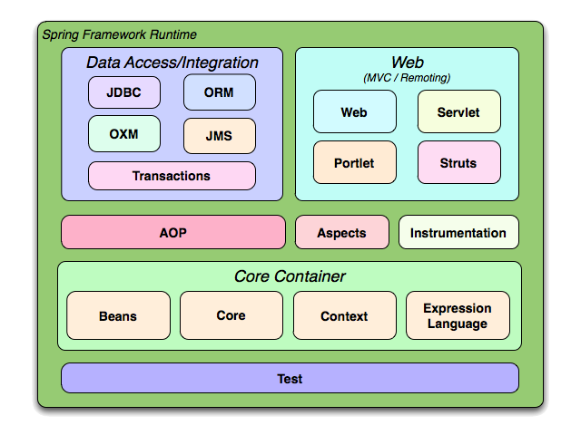
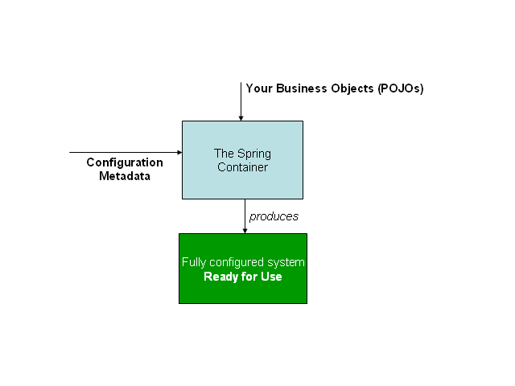
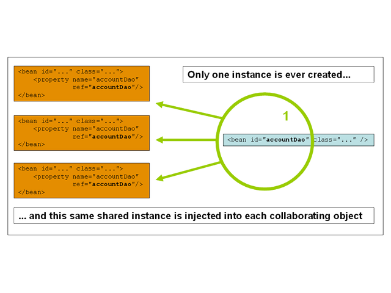
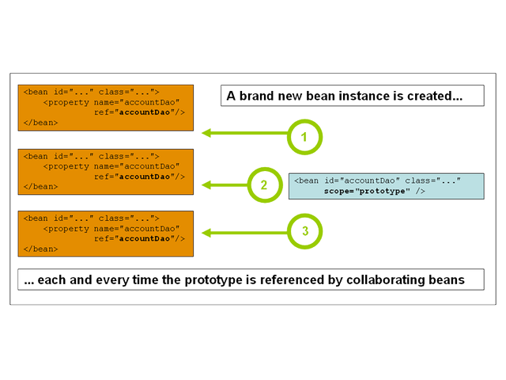

% Spring Core
% Adolfo Sanz De Diego
% Noviembre 2013

# Creditos

## Pronoide

- Pronoide consolida sus servicios de formación superando
  las **22.000 horas impartidas** en más de 500 cursos (Diciembre 2011)

- En la vorágine de **tecnologías y marcos de trabajo existentes**,
  una empresa dedica demasiado esfuerzo en
  analizar, comparar y finalmente decidir cuáles son los
  pilares sobre los que construir sus proyectos.

- Nuestros Servicios de Formación permiten ayudarle en esta tarea,
  transfiriéndoles nuestra **experiencia real de más de 10 años**.

## Autor

- **Adolfo Sanz De Diego**

- Mi nick: **asanzdiego**

- AboutMe: **[http://about.me/asanzdiego](http://about.me/asanzdiego)**

    - GitHub:   [http://github.com/asanzdiego/](http://github.com/asanzdiego/)
    - Twitter:  [http://twitter.com/asanzdiego](http://twitter.com/asanzdiego)
    - Blog:     [http://asanzdiego.blogspot.com.es](http://asanzdiego.blogspot.com.es)
    - LinkedIn: [http://www.linkedin.com/in/asanzdiego](http://www.linkedin.com/in/asanzdiego)

## Licencia

- Estas **transparencias** están bajo una licencia:
    - Creative Commons Reconocimiento-CompartirIgual 3.0 [http://creativecommons.org/licenses/by-sa/3.0/es/](http://creativecommons.org/licenses/by-sa/3.0/es/)

- El **código fuente** de los programas están bajo una licencia:
    - GPL 3.0 [http://www.viti.es/gnu/licenses/gpl.html](http://www.viti.es/gnu/licenses/gpl.html)

# Introducción

## Orígenes

- Los primeros componentes fueron escritos por **Rod Johnson en el año 2000**.
- Mientras escribía el libro **Expert One-on-one J2EE Design And Development (Programmer to programmer)**.
- Rod pensó que J2EE podín llegar a ser **más simple y consistente**.
- El proyecto fue creado en Sourceforge en **febrero de 2003**.
- Después de trabajar en su desarrollo durante más de un año se lanzó una primera versión (1.0) en **marzo de 2004**.
- Hoy en día es **uno de los framworks java más utilizados** en entornos empresariales.

## ¿Por qué Spring?

- Spring se centra en proporcionar mecanismos de **gestión de los objetos** de negocio.
- Esta estructurado en capas, **puede introducirse en proyectos de forma gradual**,
  usando las capas que nos interesen, permaneciendo toda la arquitectura consistente.
- Spring es un framework idóneo para proyectos creados desde cero y orientados a pruebas unitarias.

# Arquitectura

## Esquema

## Core Container

- Módulos **Core y Beans**
    - Proveen las **partes fundamentales** del framework incluyendo:
        - IoC (Inversion of Control)
        - DI (Dependency Injection)
    - Incluyen la clase **BeanFactory** que es una implementación sofisticada
      de los patrones de diseño Abstract Factory y Factory Method eliminando
      necesidad de programar Singletons.

- Módulo **Context**
    - A través de este módulo **podemos acceder a objetos** de una forma similar a JNDI
      (Java Naming and Directory Interface)
    - Añade, entre otros, soporte para **internacionalización**, propagación de eventos,
      creación de **contextos** de una forma transparente.

- Módulo **Expression Language**
    - Es una **extensión del unified EL** (Expressin Language) según la especificación JSP 2.1
    - Proporciona una poderosa herramienta para consultar y manipular objetos del contenedor.
    - El lenguage soporta, entre otros, **settings y gettings** de valores de propiedades,
      invocación de métodos, operadores lógicos y aritméticos.

## Data Access / Integration

- Módulo **JDBC**
    - Proporciona una capa de abstracción JDBC que nos libera de la necesidad de crear código JDBC tedioso.

- Módulo **ORM** (Object Relational Mapping)
    - Proporciona capas de integración para el mapeo de Bases de Datos relacionales.
    - Trabaja con **JPA, JDO, Hibernate e iBatis**.

- Módulo **OXM** (Object/XML)
    - Proporciona una capa de abstracción que soporta el mapeo de XML a objetos
    - Trabaja con **JAXB, Castor, XMLBeans, JiBX y XStream**.

- Módulo **JMS** (Java Message Service)
    - Contiene mecanismos para producir y consumir mensajes.

- Módulo **Transaction**
    - Soporta la gestión de transacciones para las clases que implementan interfaces especiales
      y para POJOs (Plain Old Java Objets).

## Web

- Módulo **Web**
    - Proporciona integración básica orientada a Web.
    - También provee la inicialización del contenedor IoC utilizando ServletListeners y el ApplicationContext.

- Módulo **Servlet**
    - Contiene la implementación MVC (Modelo Vista Controlador) de Spring para aplicaciones Web.

- Módulo **Struts**
    - Contiene clases de soporte para integrarse con la capa Web de Struts clásica.
    - Este soporte desde la versión 3.0 de Spring (la versión actual) está **deprecated**
    - Se recomienda migrar migrar las aplicaciones a Struts 2.0 o buscar una solución con Spring MVC

- Módulo **Portlet**
    - Proporciona la implementación MVC para ser utilizada en un entorno de portlets.

## AOP e Instrumentation

- Módulo **AOP** (Aspect Oriented Programming)
    - Proporciona una implementación para trabajar con programación orientada a aspectos.
    - Compatible con la **Alianza AOP**, para definir puntos de acceso, interceptores, proxies dinámicos, etc..

- Módulo **Aspects**
    - Proporciona integración con AspectJ.

- Módulo **Instrumentation**
    - Proporciona soporte a clases de instrumentación e implementaciones de
      classloaders que se utilizan en determinados servidores de aplicaciones.

## Testing

- Módulo **Test**
    - Soporta el testeo de componentes Spring con **JUnit y TestNG**.
    - Proporciona una carga consistente de Spring **ApplicationContexts**
      y almacenamiento en caché de esos contextos.
    - También proporciona **objetos mock** que se pueden utilizar para probar el código en forma aislada.

## Otros proyectos de Spring

- Proyecto **Spring Web Flow**
    - Un diseñador de flujos de navegación de alto nivel para aplicaciones web.

- Proyecto **Spring Web Services**
    - Especializado en la creación de Servicios Web de forma flexible.

- Proyecto **Spring Security**
    - Realiza funciones de control de acceso y autenticación personalizada.

- Proyecto **Spring Android**
    - Intenta simplificar el desarrollo de aplicaciones Android nativas.

- Proyecto **Spring Mobile**
    - Intenta simplificar el desarrollo de aplicaciones web para móviles.

- Proyecto **Spring Social**
    - Permite conectar nuestras aplicaciones con proveedores SaaS (Software as a Service) como Facebook and Twitter.

- Proyecto **Spring Data**
    - Intenta simplificar la creación de aplicaciones Spring que utilizan
      nuevas tecnologías de acceso como Bases de Datos no relacionales y
      servicios de datos basados en la nube.

# Conceptos Fundamentales

## Contenedor de Inversión de Control

- Implementación del **Principio de Hollywood** cuyo nombre proviene de las típicas
  respuestas que se les dan a los actores amateurs: **no nos llames; nosotros te llamaremos**.

- Es el **contenedor de IoC quien devuelve las instancias de las clases**
  por nombre, gestionando sus propiedades y sus relaciones.

## Inyección de Dependencias

- **Elimina el acoplamiento** de nuestros objetos de negocio con las APIs del framework.

- **Mediante configuración**, el contenedor es capaz de instanciar las dependencias
  que tiene un objeto definidas, para devolverlo ante un petición totalmente configurado,
  en tiempo de ejecución.

## Esquema

- En definitiva Spring es un contenedor ligero de **POJOs** que se encarga de su creación
  mediante Inversión de Control e Inyección de Dependencias.

## Otros aspectos

- Soporte para Aspectos e integración con AspectJ
- Manejo de Transaccionalidad
- Clases que recubren el uso de JDBC, Hibernate, iBatis, JPA, etc.
- Manejo de JMX, JMS, JavaMail
- Seguridad avanzada
- Capa Web
    - Implementación del MVC
    - Flujos Web
    - Webflow API
    - Servicios Web

# ApplicationContext

## Utilidad

- Es una interfaz que está en el paquete **org.springframework.context**.

- Carga la **configuración** del contenedor.

- Proporciona:
    - Factoría de beans, previamente configurados, realizando la inyección de dependencias.
    - MessageSource, para internacionalización con i18n.
    - Acceso a recursos, como URLs y ficheros.
    - Propagación de eventos, para las beans que implementen ApplicationListener.
    - Carga de múltiples contextos en jerarquía, permitiendo enfocar cada uno en cada capa.

## Implementaciones

- **ClassPathXmlApplicationContext**
    - Carga el archivo de configuración desde un archivo XML que se encuentra en el classpath.

- **FileSystemXmlApplicationContext**
    - Carga el archivo de configuración desde un archivo en el sistema de ficheros.

- **XmlWebApplicationContext**
    - Carga el archivo de configuración desde un XML contenido dentro de una aplicación web.

## Instanciación normal

- Si no estamos en una aplicación web, se puede buscar el recurso desde el **classpath**:

~~~{.java}
ApplicationContext appContext = new ClassPathXmlApplicationContext("appContext.xml");
~~~

- También se puede buscar el recurso desde el **sistema de ficheros**,
  en este caso relativo al directorio actual en el que nos encontremos:

~~~{.java}
ApplicationContext ctx = new FileSystemXmlApplicationContext("appContext.xml");
~~~

## Instanciación web

- En un entorno Web, podremos instanciar el ApplicationContext:

    - mediante un **listener** para Contenedores Web que soporten Servlet 2.4,
    - o mediante un servlet en un **filtro**, para versiones inferiores.

- El más empleado es el listener, **ContextLoaderListener**, que se configura en el web.xml del siguiente modo:

~~~{.xml}
<context-param>
  <param-name>contextConfigLocation</param-name>
  <param-value>/WEB-INF/applicationContext.xml</param-value>
</context-param>

<listener>
  <listener-class>
    org.springframework.web.context.ContextLoaderListener
  </listener-class>
</listener>
~~~

## Métodos disponibles

- Una vez instanciada, la interfaz dispone de 6 métodos:

    - **Boolean containsBean(String beanName)**
        - Comprobar si existe definida una bean.

    - **Object getBean(String name)**
        - Recuperar una instancia de una bean.

    - **Object getBean(String name, Class beanClass)**
        - Recuperar una instancia, con el casting hecho ya a beanClass.

    - **Class getType(String name)**
        - Retorna el Class de la bean.

    - **Boolean isSingleton(String beanName)**
        - Devuelve true si esa bean es un singleton.

    - **String[] getAliases(String beanName)**
        - Devuelve los alias de la bean con ese nombre.

## Fichero de configuración

- Dentro de la etiqueta **\<beans>** definiremos una instancia de una clase con la etiqueta **\<bean>**.

- Tienen los siguientes atributos:
    - **Id**: identifcador único de la bean en el contenedor.
    - **Name**: para nombrar una bean de varias maneras.
    - **Alias**: renombra una definición existente.
    - **Class**: la clase que implementará la bean.

## Instanciación de objetos

- Con **constructor** (por defecto): Se suele usar un constructor sin parámetros
  pero también se pueden utilizar.

~~~{.xml}
<bean id="exampleBean1" class="examples.ExampleBean1">
  <constructor-arg index="0" value="This is a String constructor parameter" />
  <constructor-arg index="1" value="33" />
</bean>
~~~

- Con **factoría estática**: Un método estático en el bean defindo en el atributo factory-method.

~~~{.xml}
<bean id="exampleBean" class="examples.ExampleBean2" factory-method="createInstance" />
~~~

- Con **factoría instanciada**: Una clase definida en el atributo factory-bean es la que instancia las demás.

~~~{.xml}
<bean id="myFactoryBean" class="..." />
<bean id="example1" factory-bean="myFactoryBean" factory-method="createInstance" />
~~~

# Inyección de dependencias

## Definición

- Las dependencias se crean cuando **un bean necesita otro bean** para desempeñar sus funciones.
- Las inyecciones de dependencias pueden establecerse por setter o como argumento del constructor.
- Se recomienda el uso de **setters**:
    - Una dependencia en una clase de negocio tendrá un **atributo privado** de ese tipo
    - y un **setter público** que lo establece.
- Las dependencias pueden ser de 2 tipos:
    - **valores**: Se especifica un valor, ya sea numérico, de texto, etc.
    - **otros beans**: Se especifica otro bean definido en el appContext.xml.

## Inyección de valores

~~~{.xml}
<?xml version="1.0" encoding="UTF-8"?>
<beans xmlns="http://www.springframework.org/schema/beans"
  xmlns:xsi="http://www.w3.org/2001/XMLSchema-instance"
  xmlns:p="http://www.springframework.org/schema/p"
  xsi:schemaLocation="http://www.springframework.org/schema/beans/spring-beans.xsd">

  <bean id="plantillaPerosona" class="beans.Persona">
    <property name="nombre" value="Pepe" />
    <property name="edad" value="33" />
  </bean>

</beans>
~~~

## Inyección de otros beans

~~~{.xml}
<?xml version="1.0" encoding="UTF-8"?>
<beans xmlns="http://www.springframework.org/schema/beans"
       xmlns:xsi="http://www.w3.org/2001/XMLSchema-instance"
       xsi:schemaLocation="http://www.springframework.org/schema/beans
           http://www.springframework.org/schema/beans/spring-beans-3.0.xsd">

  <bean id="plantillaDireccion" class="beans.Direccion">
    <property name="calle" value="Alcalá" />
    <property name="numero" value="22" />
  </bean>

  <bean id="plantillaPersona" class="beans.Persona">
    <property name="nombre" value="Pepe" />
    <property name="direccion" ref="plantillaDireccion" />
  </bean>

</beans>
~~~

## Inyección de un inner bean

~~~{.xml}
<?xml version="1.0" encoding="UTF-8"?>
<beans xmlns="http://www.springframework.org/schema/beans"
       xmlns:xsi="http://www.w3.org/2001/XMLSchema-instance"
       xsi:schemaLocation="http://www.springframework.org/schema/beans
           http://www.springframework.org/schema/beans/spring-beans-3.0.xsd">

  <bean id="plantillaPersona" class="beans.Persona">
    <property name="nombre" value="Pepe" />
    <property name="direccion">
      <bean class="beans.Direccion">
        <property name="calle" value="Alcalá" />
        <property name="numero" value="22" />
      </bean>
    <property/>
  </bean>

</beans>
~~~

## Inyección de colecciones

~~~{.xml}
<list>
  <value>un texto que representa un item de la lista, seguido por una referencia</value>
  <ref bean="myDataSource" />
</list>
~~~

~~~{.xml}
<set>
  <value>otro texto, seguido también por una referencia</value>
  <ref bean="myDataSource" />
</set>
~~~

~~~{.xml}
<map>
  <entry key="JUAN" value="un texto para la clave JUAN" />
  <entry key="PEPE" value-ref="miPersona" />
</map>
~~~

~~~{.xml}
<!--java.util.Properties.-->
<props>
  <prop key="adm">administrator@somecompany.org</prop>
</props>
~~~

## Inyección de nulos y cadenas vacías

- Cadena vacía:

~~~{.xml}
<bean class="ExampleBean">
  <property name="email" value="" />
</bean>
~~~

- Valor nulo:

~~~{.xml}
<bean class="ExampleBean">
  <property name="email"><null/></property>
</bean>
~~~

## Dependencias indirectas

- Cuando no existe dependencia, pero se necesita que un bean esté
  instanciado antes que otro, deberemos usar el atributo **depends-on="nombreDelBean"**

~~~{.xml}
<bean id="beanOne" class="ExampleBean" depends-on="manager" />

<bean id="manager" class="ManagerBean" />
~~~

## Herencias

- La etiqueta <bean> provee 2 atributos para utilizar la herencia:
    - **parent**: Indica el id del bean que se utilizará como padre.
      Concepto similar al extends en las clases Java.
    - **abstract**: Si es "true" indica que el bean declarado es abstracto,
      es decir, sólo se podrán instanciar sus hijos.

- En el siguiente ejemplo el bean "julio", hereda del bean "personaGenerica",
  y sobreescribe el valor de la propiedad "nombre".

~~~{.xml}
<bean id="personaGenerica" class="beans.Persona" abstract="true">
  <property name="nombre"><null /></property>
  <property name="cp" value="28001" />
</bean>
~~~

~~~{.xml}
<bean id="julio" parent="personaGenerica">
  <property name="nombre" value="Julio" />
</bean>
~~~

# Autowiring

## Definición

- Consiste en la **inyección de dependencias automática**
  sin necesidad de indicarla en la configuración de una bean.

- Spring proporciona **4 tipos** de autowiring:
    - Por nombre (byName)
    - Por tipo (byType)
    - Por constructor (constructor)
    - Autodetectado (autodetect)

## Autowiring: byName

- El contenedor busca un bean cuyo **nombre (id)** sea el mismo que el nombre de la propiedad.

~~~{.xml}
<bean id="persona" class="beans.Persona" autowire="byName">
  <property name="nombre" value="persona"/>
</bean>

<bean id="direccion" class="beans.Direccion">
  <property name="cp" value="28900"/>
</bean>
~~~

- Si no se encuentra coincidencia la propiedad se devolverá sin dependencia.

## Autowiring: byType

- El contenedor busca un único bean cuyo **tipo (class)** coincida con el tipo de la propiedad a inyectar.

~~~{.xml}
<bean id="persona" class="beans.Persona" autowire="byType">
  <property name="nombre" value="persona"/>
</bean>

<bean id="direccion" class="beans.Direccion">
  <property name="cp" value="28900"/>
</bean>
~~~

- Si no se encuentra coincidencia la propiedad se devolverá sin dependencia.
- Si se encuentra más de una coincidencia el contenedor lanzará una excepción del tipo
    - **org.springframework.beans.factory.UnsatisfiedDependencyException**

## Autowiring: constructor

- El contenedor busca algun bean que contenga un **constructor con el tipo** del bean que se quiere inyectar.

~~~{.xml}
<bean id="persona" class="beans.Persona" autowire="constructor">
  <property name="nombre" value="persona"/>
</bean>
~~~

~~~{.java}
public Persona(Direccion dir){
  this.direccion = dir;
}
~~~

- Si no se encuentra coincidencia la propiedad se devolverá sin dependencia.
- Si se encuentra más de una coincidencia el contenedor lanzará una excepción del tipo
    - **org.springframework.beans.factory.UnsatisfiedDependencyException**

## Autowiring: autodetect

- Spring intenta realizar el autowiring **por constructor y si no por tipo**.

~~~{.xml}
<bean id="persona" class="beans.Persona" autowire="autodetect">
  <property name="nombre" value="persona"/>
</bean>
~~~

- Si no se encuentra coincidencia la propiedad se devolverá sin dependencia.
- Si se encuentra más de una coincidencia el contenedor lanzará una excepción del tipo
    - **org.springframework.beans.factory.UnsatisfiedDependencyException**

## Resumen

- Autowiring parece una **poderosa herramienta** de configuración pero impone algunas **restricciones**.
    - Por tipo y constructor obliga a tener un único bean definido que satisfaga el wiring.
    - Por nombre tiene problemas de refactorización.
    - Los plugins no documentan correctamente el autowiring.

- Autowiring **funciona bien cuando es usado de forma habitual** en todo el proyecto.

- Si el autowiring no se utiliza de forma generalizada, **puede ser confuso** para los desarrolladores.

# Scopes

## Singleton Scope

- Es el scope que se utiliza **por defecto**.

- Se crea **una instancia única** por JVM.

## Prototype Scope

- Se crea **una nueva instancia cada vez** que se pide el bean.

- Se utiliza el atributo **scope="prototype"**

## Web Application Scopes

- **Request**
    - Una instancia por petición http.

- **Session**
    - Una instancia por sesión http.

- **GlobalSession**
    - Una instancia por sesión http en Portlets.

**Nota**: Si un bean de tipo singleton tiene una dependencia de otro bean
de ámbito session o request, deberá indicarse que esa dependencia
se creará a través de un proxy, con la etiqueta **\<aop:scoped-proxy/>**

## Carga perezosa

- Spring instancia los singleton cuando el archivo de configuración se carga.

- Es una buena práctica aunque puede causar problemas.

- Mediante el atributo **lazy-init="true"** podemos indicarle al contenedor
  que no cargue el bean hasta que se pida por primera vez.

# Ciclo de vida

## Gestión por configuración

- Es posible controlar el ciclo de vida de una bean configurada en el contenedor IoC,
  mediante unos **métodos de inicialización y de destrucción** de la bean.

- Estos métodos deben existir en la bean, y puede indicarse al contenedor
  que los invoque en los momentos indicados, con los atributos **init-method=""** y **destroy-method=""**.

- Se puede definir en la etiqueta **\<beans/>** con **default-init-method=""** y **default-destroy-method=""**
  los métodos que se intentará invocar en todas las beans configuradas, si existen dichos métodos.

## Gestión con interfaces

- Existen 2 interfaces que nos permiten manejar el ciclo de vida de una bean
  de la misma forma que con init-method y destroy-method:

    - **InitializingBean**
        - Obliga a la clase que la implemente a implementar el método **afterPropertiesSet()**
          que será llamado después de que todas las propiedades de la bean hayan sido configuradas.

    - **DisposableBean**
        - Obliga a implementar el método **destroy()** que será llamado justo antes
          de destruir la bean por el contenedor.

## Destrucción del contenedor IoC

- Cuando no se esté en un contexto Web, la destrucción del contendor IoC se deberá registar
  invocando el método **registerShutdownHook()** en el AbstractBeanFactory.

# i18n

## MessageSource

- ApplicationContext extiende una interfaz llamada MessageSource, que proporciona los métodos:

    - **String getMessage(String code, Object[] args, String default, Locale loc)**:
        - Método básico para recuperar un mensaje del MessageSource.
        - Si no se encuentra un mensaje, se usa el default.

    - **String getMessage(String code, Object[] args, Locale loc)**:
        - Similar pero sin mensaje por defecto.

    - **String getMessage(MessageSourceResolvable resolvable, Locale locale)**:
        - En este caso, MessageSourceResolvable, agrupa los argumentos de los métodos anteriores.

## Configuración

- Cuando un ApplicationContext se carga, automáticamente busca el **bean llamado
  messageSource** definida en el fichero de configuración.

- Si se encuentra, todas las llamadas a los métodos anteriores se delegan sobre ella.

- Spring proporciona 2 implementaciones de MessageSource, **ResourceBundleMessageSource** y **StaticMessageSource**.

- El más usado es el primero, que permite definir las ubicaciones de los ficheros .properties que se van a utilizar.

## Ejemplo de configuración

~~~{.xml}
<bean id="messageSource"
      class="org.springframework.context.support.ResourceBundleMessageSource">
  <property name="basenames">
    <list>
      <value>format</value>
      <value>exceptions</value>
    </list>
  </property>
</bean>
~~~

- En este caso, deberemos tener 2 ficheros en el raíz del classpath,
  con los nombres **format.properties** y **exceptions.properties**.

- Admite el resto de ficheros con los sufijos de locale para internacionalización.

## Ejemplo de uso

- En código java:

~~~{.java}
MessageSource resources = new ClassPathXmlApplicationContext("beans.xml");
Locale locale = ...; //Locale correspondiente
Integer id = ...; // id del usuario
String text = resources.getMessage("usuario.id", new Object[id], "Mensaje por defecto", locale);
~~~

- En una JSP, mediante la librería de etiquetas proporcionada por Spring:

~~~{.xml}
<spring:message code="usuario.id" />
~~~

# Eventos

## Eventos de Spring

- El manejo de eventos se proporciona a través de la clase **ApplicationEvent**
  y la interfaz **ApplicationListener**.

- Si un bean implementa ApplicationListener, cada vez que se publica
  un ApplicationEvent en el ApplicationContext, el bean es notificada.

- Hay 3 eventos proporcionados por Spring:
    - **ContextRefreshedEvent**:
      Evento publicado cuando el ApplicationContext se inicializa o refresca.
    - **ContextClosedEvent**:
      Evento publicado cuando se cierra el ApplicationContext.
    - **RequestHandledEvent**:
      Evento específico para aplicaciones web que avisa que
      todos los beans de una petición HTTP han sido servidos.

## Eventos personalizados

- Se pueden implementar eventos personalizado simplemente llamando
  al método **publishEvent()** de ApplicationContext, pasando como parámetro
  una instancia de una clase personalizada que implemente ApplicationEvent.

- Cuando un listener (ApplicationListener) recibe una notificación de un evento,
  se invoca su método **onApplicationEvent()**, al que se le pasa el evento,
  donde realizaremos la acción pertinente.

- Dichos listener reciben los eventos **de forma síncrona**,
  bloqueándose hasta terminar de procesar el evento.

# Acceso a recursos

## ResourceLoader

- Como en otros frameworks, Spring nos ofrece un acceso sencillo a
  los recursos que necesitemos.

- Para ello, un ApplicationContext, es también un **ResourceLoader**,
  que nos proporciona la capacidad de cargar recursos.

- Un recurso es fundamentalmente un **java.net.URL**, que puede usarse
  para recuperar recursos de casi cualquier ubicación de forma transparente.

- Un bean desplegado en el ApplicationContext, puede acceder a recursos
  implementando la interfaz **ResourceLoaderAware**, para que se le pase
  durante la inicialización el ApplicationContext, en forma de ResourceLoader,
  con **setResourceLoader()**.

## Resource

- La interfaz Resource, proporciona los siguientes métodos:

    - **InputStream getInputStream() throws IOException**:
        - Localiza y abre el recurso para leer. Debe cerrarse el inputStream obtenido.

    - **boolean exists()**:
        - Indica si el recurso existe físicamente.

    - **boolean isOpen()**:
        - Indica si el recurso está abierto.

    - **URL getURL() throws IOException**:
        - Retorna la URL del recurso.

    - **File getFile() throws IOException**;
        - Retorna un objeto de tipo File que encapsula el recurso.

    - **Resource createRelative(String relativePath) throws IOException**:
        - Crea un recurso relativo en la misma ubicación que el actual.

    - **String getFilename()**;
        - Devuelve el nombre del recurso.

    - **String getDescription()**:
        - Devuelve una descripción del recurso.

## Implementaciones de Resource

- En Spring están disponibles varias implementaciones de Resource:

- **URLResource**:
    - Encapsula un **java.net.URL**, y permite acceder a ficheros que
      pueden representarse por su URL, con el prefijo correspondiente,
      **file:**, **http:**, **ftp:**, etc..

- **ClassPathResource**:
    - Indica un recurso que puede obtenerse del ClassPath.
      Puede indicarse el tipo con el prefijo **classpath:**

- **FileSystemResource**:
    - Encapsula un **java.io.File**.

- **ServletContextResource**:
    - Interpreta rutas relativas desde la raíz de la aplicación web.

## ResourceLoader

- ApplicationContext hereda de ResourceLoader, que proporciona
  el método **getResource(String location)**, con el que se accede a los recursos.

~~~{.java}
Resource template = ctx.getResource("file:/some/resource/path/myTemplate.txt");
~~~

- También se pueden definir recuros como dependencias en el fichero de configuración.

~~~{.xml}
<property name="template" value="classpath:some/resource/path/myTemplate.txt">
~~~

- El String pasado (**location**), se convierte a la implementación de Resource más adecuada.

- Si se indica un **prefijo de URL**, dependiendo del prefijo, se devolverá una instancia u otra.

- Si no se indica el prefijo, se nos devolverá una implementación acorde al tipo de ApplicationContext que hayamos creado:

    - ClassPathXmlApplicationContext: ClassPathResource.

    - FileSystemXmlApplicationContext: FileSystemResource

    - WebApplicationContext: ServletContextResource
