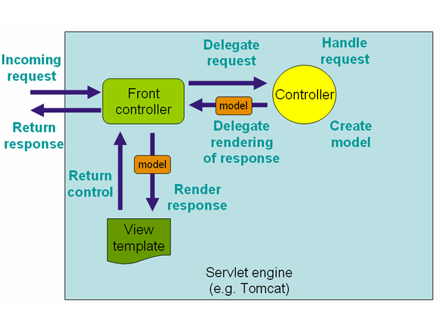
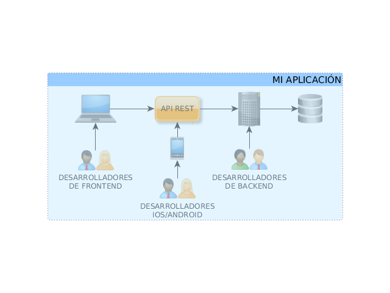
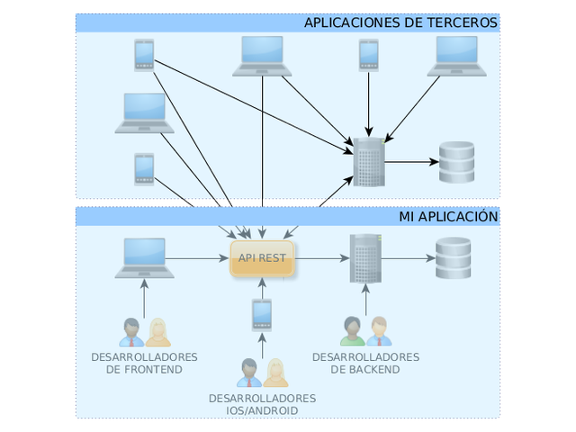

% Spring MVC
% Adolfo Sanz De Diego
% Noviembre 2013

# Creditos

## Pronoide

- Pronoide consolida sus servicios de formación superando
  las **22.000 horas impartidas** en más de 500 cursos (Diciembre 2011)

- En la vorágine de **tecnologías y marcos de trabajo existentes**,
  una empresa dedica demasiado esfuerzo en
  analizar, comparar y finalmente decidir cuáles son los
  pilares sobre los que construir sus proyectos.

- Nuestros Servicios de Formación permiten ayudarle en esta tarea,
  transfiriéndoles nuestra **experiencia real de más de 10 años**.

## Autor

- **Adolfo Sanz De Diego**

- Mi nick: **asanzdiego**

- AboutMe: **[http://about.me/asanzdiego](http://about.me/asanzdiego)**

    - GitHub:   [http://github.com/asanzdiego/](http://github.com/asanzdiego/)
    - Twitter:  [http://twitter.com/asanzdiego](http://twitter.com/asanzdiego)
    - Blog:     [http://asanzdiego.blogspot.com.es](http://asanzdiego.blogspot.com.es)
    - LinkedIn: [http://www.linkedin.com/in/asanzdiego](http://www.linkedin.com/in/asanzdiego)

## Licencia

- Estas **transparencias** están bajo una licencia:
    - Creative Commons Reconocimiento-CompartirIgual 3.0 [http://creativecommons.org/licenses/by-sa/3.0/es/](http://creativecommons.org/licenses/by-sa/3.0/es/)

- El **código fuente** de los programas están bajo una licencia:
    - GPL 3.0 [http://www.viti.es/gnu/licenses/gpl.html](http://www.viti.es/gnu/licenses/gpl.html)

# Introducción

## Características

- Clara separación de roles.
- Configuración potente tanto del framework como de la aplicación.
- Adaptable, no intrusivo, y flexible.
- Clases de negocio reutilizables.
- Validación y conversión personalizable.
- Mapeo del controlador y de la vista personalizable. 
- Tansferencia flexible de datos.
- Soporta internacionalización.
- Permite usar JSP, con o sin etiquetas de Spring, JSTL, velocity.

## Esquema

# Configuración

## web.xml

~~~{.xml}
<web-app>

	<listener>
		<listener-class>org.springframework.web.context.ContextLoaderListener</listener-class>
	</listener>

	<servlet>
		<servlet-name>appServlet</servlet-name>
		<servlet-class>org.springframework.web.servlet.DispatcherServlet</servlet-class>
		<init-param>
			<param-name>contextConfigLocation</param-name>
			<param-value>/WEB-INF/spring/appServlet/servlet-context.xml</param-value>
		</init-param>
		<load-on-startup>1</load-on-startup>
	</servlet>

	<servlet-mapping>
		<servlet-name>appServlet</servlet-name>
		<url-pattern>/</url-pattern>
	</servlet-mapping>

</web-app>
~~~

## servlet-context.xml

~~~{.xml}
<beans>

	<!-- Enables the Spring MVC @Controller programming model -->
	<annotation-driven />

	<!-- Resolves views selected for rendering by @Controllers to .jsp resources in the /WEB-INF/views directory -->
	<beans:bean class="org.springframework.web.servlet.view.InternalResourceViewResolver">
		<beans:property name="prefix" value="/WEB-INF/views/" />
		<beans:property name="suffix" value=".jsp" />
	</beans:bean>

	<context:component-scan base-package="my.package.my.app" />

</beans>
~~~

## Vía rápida

- En el **STS** (Spring Tool Suite):
    - New > Spring Template Project > Spring MVC Project

## Mapping Requests

- By path
- By path pattern
- By path and method
- By path, method, and presence of parameter
- By path, method, and not presence of parameter
- By presence of header
- By absence of header

# APIs ¿Para qué?

## Aplicación estándar

## Introducimos API

## Separación Roles

## ¿Y ahora qué?

## Servicios externos

## Apps clientes

## Apps de servicios

## Apps mixtas

## Plataforma

## ¿Quien expone APIs?

## ¿Quien expone APIs?

## ¿Quien expone APIs?

## Exponlas tú

## Exponlas tú

## Exponlas tú

# APIs RESTful

## ¿Qué es REST?

- REST (**Representational State Transfer**) es una técnica de arquitectura de
  software para sistemas hipermedia distribuidos como la World Wide Web.

- En REST una **URL** (Uniform Resource Locator) representa un **recurso**.

- Se puede acceder al recurso o modificarlo mediante los **métodos del protocolo HTTP**:

        GET, POST, PUT, DELETE

## Ejemplo API

- **http://myhost.com/talk**

    - GET > Devuelve todas las charlas.
    - POST > Crear una nueva charla.

- **http://myhost.com/talk/123**

    - GET > Devuelve la charla con id=123
    - PUT > Actualiza la charla con id=123
    - DELETE > Borra la charla con id=123

## Manejo de errores

- **Se pueden utilizar los errores del protocolo HTTP**:

    - 200 Successful
    - 201 Created
    - 202 Accepted
    - 301 Moved Permanently
    - 400 Bad Request
    - 401 Unauthorised
    - 402 Payment Required
    - 403 Forbidden
    - 404 Not Found
    - 405 Method Not Allowed
    - 500 Internal Server Error
    - 501 Not Implemented

## ¿Por qué REST?

- Es **más sencillo** (tanto la API como la implementación).
- Es **más rápido** (peticiones más lijeras que se pueden cachear).
- Es **multiformato** (HTML, XML, JSON, etc.).
- Se complementa muy bien con **AJAX**.

## REST vs RESTful

- REST se refiere a un tipo de arquitectura de software

    - Se utiliza como **nombre**
    - Se utiliza como por ejemplo: success = éxito.

- Si un servicio web es REST**ful** indica que implementa dicha arquitectura.

    - Se utiliza como **adjetivo**
    - Se utiliza como por ejemplo: success**ful** = éxito**so**).

## REST vs RESTful

- A veces el **ful** se confunde con **full** = completo.

    - Y se refiere a los servicios web REST**full** 

            Aquellos que implementan una API con
            todos los métodos del protócolo HTTP.

    - Y se refiere a los servicios web REST (**sin el full**)

            Aquellos que NO implementan una API con
            todos los métodos del protócolo HTTP.
